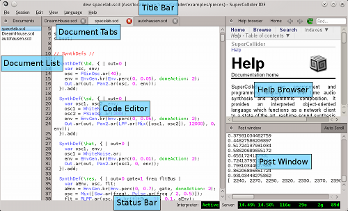

# Table of Contents

1.  [Introductory Remarks on SuperCollider](#org118a56f)
    1.  [Resources](#orgaeb3ed5)
2.  [The IDE](#orgba5e8d1)
    1.  [Post Window](#org894a5f5)
    2.  [Help](#org855d9ab)
3.  [Server and language](#org076d154)
    1.  [Code execution](#org2ddcd4c)
    2.  [Running a line](#org8f94723)
    3.  [Running two lines](#org67caecc)
4.  [Discussion](#orgd44ebcf)
    1.  [Commenting](#org5c839e6)

# Introductory Remarks on SuperCollider

Programming audio applications and interactive sound synthesis software,
using the SuperCollider programming language.

SuperCollider (SC) (<https://supercollider.github.io/>) is a programming
language for audio synthesis; it provides a state of the art server to
create sound and a programming language to interact and evaluate code,
as well as a fully functional IDE and help browser. SC is oriented for
sound synthesis and algorithmic composition providing a series of ready
made classes to manipulate and create real time sound on the computer.

Creating sound with SC can be very rewarding using its ready made unit
generators to build novel instruments and sound generators. Firstly,
let&rsquo;s take a look on the IDE of the SuperCollider.

## Resources

If you haven&rsquo;t already downloaded the language so far, do so now from
this link: <https://supercollider.github.io/>

# The IDE

Take a tour on the Menu of SC and try to save some files as you would
save anything in your operation system. Try to memorize the keyboard
shortcuts working in SC.

## Post Window

Once you start SC most likely, you will see a blank page, and some text
printed on the side of the window inside the IDE. In the SC ecosystem,
this is what is called the Post Window. This provides important
information about several things while working, including:

-   Classes included in your SC installation.
-   Audio information
    -   such as sample rate
    -   audio interfaces connected
    -   ins and outs of these
    -   and some optimistic messages.

Assuming there is no problem with your installation shown in the post
window, you are ready to start coding.

## Help

There is a plethora of tutorials and help files in the native help file
system of SC. Reached from the IDE you may search and learn specific and
general topics covered inside the provided files.

# Server and language

SC is two applications, (more specifically is three), but what is important now
is to understand that when working in SC we actually interact with the
synthesis engine, named Server, it is responsible to create the sound
for us by taking orders by the language, hence the Server. The orders we
give are interpreted in some language that the Server understands, but
we not. The language we write is translated by the interpreter once we
evaluate or execute a line of code.

## Code execution

Try to do some mathematical calculations in SC and see what happens. For
testing run this on top of your blank page in the IDE.

    1+1

## Running a line

There is no bigger pleasure of executing something in SC and realizing
that your code was evaluated properly and no complains in post window
appeared.

## Running two lines

In the previous example we run a single line. Okay, but common sense
suggests that, even the most clever and coding ninjas have to run more
than one line to make something useful. So this why the semicolon sign
in your keyboard will be your best friend from now on, while practicing
SC. The ; is the sign that divides two lines of code, allowing to run
bigger expressions, so assuming we have two math operations below and a
string:

    (
      11 + 11;
      22 * 1.0;
    "Hello World"
    )

This is your first program. If there is no error on the above, then you
must see something posted in the next window. Therefore, the post
window is vital providing us debugging information and tips on things
that we are trying to execute in SC. Try to evaluate the following
block:

    (
      1 + 3
    Hello World
    )

Most likely, you have something like this appearing in the post window.
In addition to the number you also see something that you can read, this
is called a string, and can be used anywhere inside a line of code, most
of the time we combine these two.

    ERROR: syntax error, unexpected STRING, expecting DOTDOT or ':' or ',' or ')'
      in interpreted text
      line 4 char 0:
      )
      ^^^^^^^^^^^^
    -----------------------------------
    ERROR: Command line parse failed
    -> nil

This means that there is something wrong with the code you are trying to
run. SC most of the times is smart about where the problem is probably
hanging. In this case it says, that there is something missing in line
4, can you guess what&rsquo;s that?

# Discussion

Try to generate some numbers, code some lines that create some
mathematical operations. At the end you must print this

    my name
    is 3 hundred

## Commenting

It is very important to add some notes on your software when coding.
This will help you and others to remember and/or explain what is
happening inside some blocks of code. Any line that starts with two //
is a comment and it will not be taken in account when executing it.

    
    "Hello" //this is a string.

Thus it makes it very convenient to add notes and any other necessary
information we want to have inside our programs.

