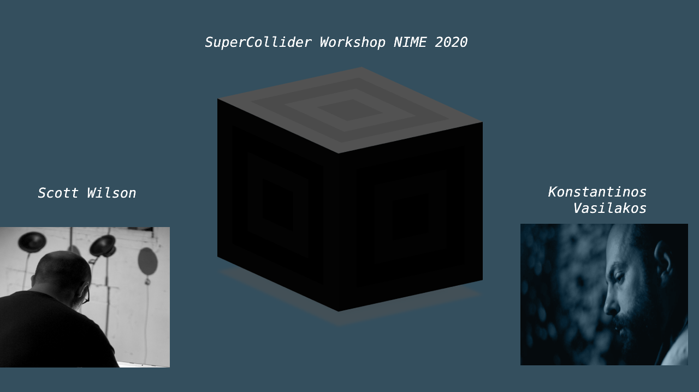

# Table of Contents

1.  [First Steps](#orgf8b6e79)
    1.  [Overview of SC](#org6813e6f)
        1.  [Some Basic Concepts in SC](#org38c18cd)
2.  [Making Sound](#org8e2e274)
    1.  [Create some Synthesizers using:](#org65b6e20)
    2.  [Events: Control of SynthDefs](#org78f5b28)
        1.  [Examples of Patterns](#org7716d76)
3.  [Hardware Interaction](#org30285b9)
    1.  [Connect Devices](#org6e9c050)
    2.  [Modality](#org98765a9)
        1.  [More Examples on Modality](#orgb9fc6c9)
        2.  [Connect More Devices](#org606ac7e)

# First Steps

## Overview of SC

[Introduction](first-steps/Introduction.md)

### Some Basic Concepts in SC

[Variables & Functions](first-steps/Basics.md)

# Making Sound

## Create some Synthesizers using:

[SynthDefs](first-steps/SynthDefs.md)

## Events: Control of SynthDefs

### Examples of Patterns

[Pattern Example](Interaction/Pattern-examples.md)

# Hardware Interaction

## Connect Devices

[Input Sources](Interaction/Input-Sources.md)

## Modality

[What is Modality Toolkit](https://modalityteam.github.io)

### More Examples on Modality

[Modality Examples](Interaction/Modality-Examples.md)

### Connect More Devices

[Other Inputs](Interaction/Other-Inputs.md)

